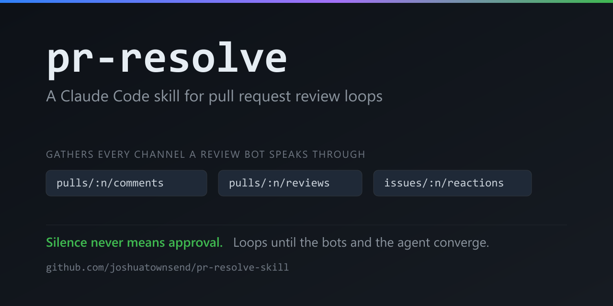

# pr-resolve



A Claude Code skill that takes a pull request from "the bots have reviewed it" to
merged — gathering every review finding, fixing them, verifying, and looping
until the reviewers and the agent actually agree.

It exists because the obvious version of this workflow doesn't work.
`gh pr view --comments` shows neither a bot's 👍 verdict nor the findings Copilot
suppresses inside a review body, so an agent following the obvious path reports
a clean PR while five real defects sit unaddressed.

## Install

### As a plugin (recommended)

This repo is also a Claude Code marketplace, so the plugin installs and updates
in place:

```
/plugin marketplace add joshuatownsend/pr-resolve-skill
/plugin install pr-resolve@joshuatownsend-skills
```

### By hand

Skills are discovered by scanning for subdirectories containing a `SKILL.md`.
Copy `skills/pr-resolve/` into either location:

```bash
# available in every project
mkdir -p ~/.claude/skills
cp -r skills/pr-resolve ~/.claude/skills/

# or scoped to one project
mkdir -p .claude/skills
cp -r skills/pr-resolve .claude/skills/
```

The `mkdir -p` matters. Without it, `cp` treats a missing `skills` as the
destination name and silently lands `SKILL.md` at `~/.claude/skills/SKILL.md`,
reporting success while leaving the skill undiscoverable.

Both hot-reload — no session restart needed.

## Use

```
/pr-resolve <PR number>
```

## What it does

1. **Gather** findings from all three channels — inline comments, review bodies,
   and PR-level reactions — then confirm someone has actually reviewed the
   current head.
2. **Reaction semantics** — distinguish "still reading" from "reviewed, clean."
3. **Fix** in-session by default; delegate only when the work would flood
   context.
4. **Verify** with typecheck and the full test suite, reporting an exact pass
   count.
5. **Push**, recording the push time locally.
6. **Wait** for a fresh verdict, and decide whether another round is warranted.
7. **Summarize** to the PR.
8. **Merge** on approval.

Steps 1–2 only read. Several trigger phrases are questions — "any new comments
on the PR", "check for bot comments" — so when you ask one, the skill gathers,
reports, and stops. It goes on to fix, push, and comment only when you ask it
to resolve what it found.

## The parts that aren't obvious

Most of this skill is a response to a specific way the loop fails.

**Review signal arrives on three separate channels.** Inline comments live at
`pulls/{n}/comments`, review bodies at `pulls/{n}/reviews`, and bot verdicts
arrive as reactions at `issues/{n}/reactions` — note `issues/`, because GitHub
models a PR as an issue for anything conversation-level. Query one and you miss
the others.

**A Copilot review claiming "generated no new comments" can still carry
findings**, hidden in a `<details>` block in the body.

**👀 means reading; 👍 means reviewed-and-clean.** Codex *swaps* its reaction
rather than adding one, so the question is never "has this bot ever thumbs-upped
this PR" — it's "is its latest reaction a 👍, newer than my last push." A stale
👍 is indistinguishable from a fresh one except by timestamp, and there is no
push timestamp anywhere in the GitHub API, so the skill records one locally at
push time.

**Empty is not clean.** A gather that finds nothing on an unreviewed PR means
nobody has looked yet, not that there's nothing to find. Silence is the one
signal that never means approval.

**Convergence, not universal cleanliness.** Waiting for every reviewer to go
quiet cannot terminate: each push re-triggers the bots, any fresh nit needs
another push, and that push triggers another review. So the skill decides by
severity — a cosmetic round proceeds, a substantive one loops — and treats a
bot re-raising a *declined* finding as a known disagreement rather than a reason
to keep going.

**Delegation protects context, not effort.** Findings usually arrive with a file,
a line, and a diagnosis; a fresh subagent would only re-derive them. So fixes
happen in-session unless diagnosis needs wide reading. When delegating, Sonnet is
the default and escalation is evidence-driven — a wrong result retries one tier
up, not again at the same tier.

**Reviewers differ in when they run, so the skill resolves state rather than
assuming.** Codex re-reviews on every push; Copilot reviews once per request and
then stops. Waiting for a finished reviewer to "come back" hangs forever, so the
skill treats *reviewed-but-not-pending* as done and re-requests it explicitly
when a substantive change landed after its verdict.

**Re-requesting Copilot needs GraphQL.** It is a Bot, not a user, so
`POST .../requested_reviewers` with `reviewers: ["Copilot"]` returns **201 and
silently discards the request** — no pending entry, no timeline event, no
review. The `requestReviews` mutation with `botIds` works, and a real request is
visible in both `reviewRequests` and the timeline.

## Where this came from

The reaction semantics and the suppressed-findings behavior were found the hard
way on a live PR. The round-management and arrival-wait rules came from reviewing
131 past sessions that invoked an earlier version of this skill, which surfaced
19 occasions where the user hand-timed the invocation because the skill didn't
know when to start, and one where the agent insisted no review existed while a 👍
sat on the PR. That analysis is itself a skill:
[transcript-review](https://github.com/joshuatownsend/transcript-review-skill).

## Requirements and caveats

- The `gh` CLI, authenticated for the target repository.
- Step 4 names `npm run typecheck` and "the full test suite." That's
  Node-flavored — adapt it to the project's actual verification commands.
- Merging with `--admin` requires permission to bypass branch protection.
- The verification and approval gates are what keep this from merging unverified
  work. Loosen them deliberately, if at all.
